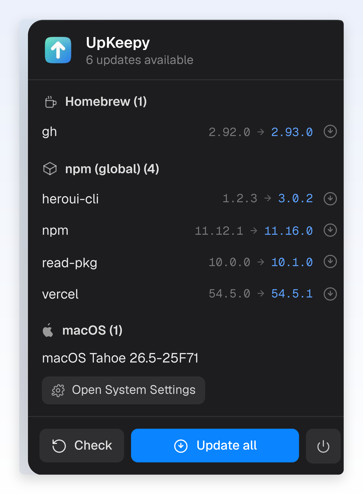
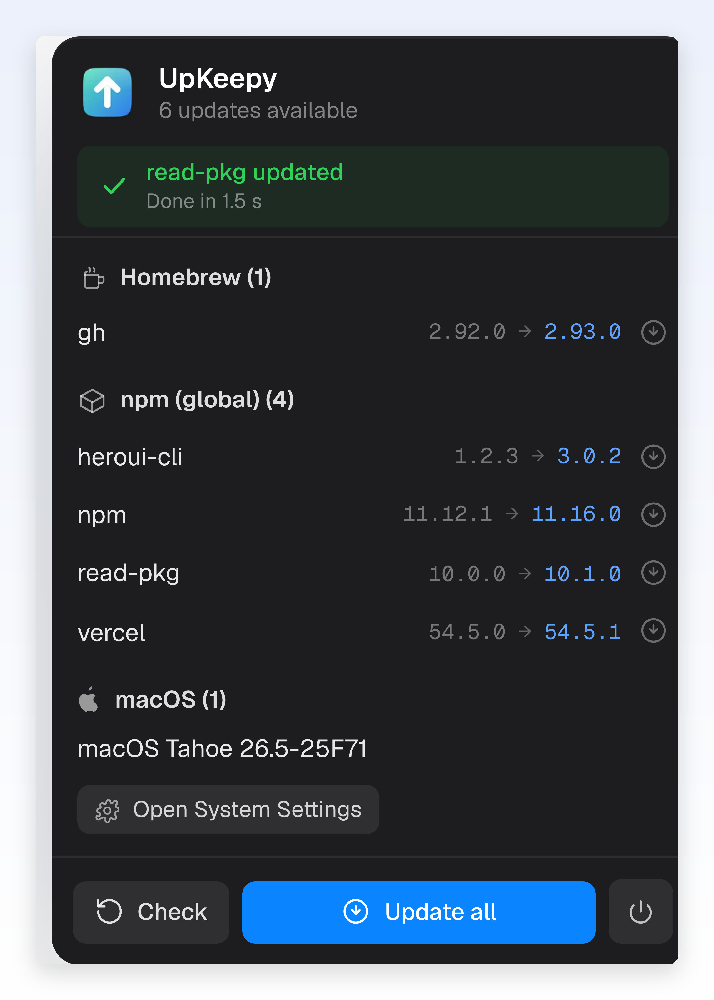

# UpKeepy

A small macOS **menu bar** app that keeps your Mac up to date, like `topgrade`
but graphical and one click away, with a feature `brew` itself can't do:
**ghost cask detection**.

**[upkeepy.fr](https://upkeepy.fr)** · `macOS 14+` · `Swift / SwiftUI` · Open source (MIT)



## What it does

- **Homebrew**: formulae + apps (casks), with automatic `cleanup`.
- **npm**: outdated global packages, installed at the **exact version** (not
  `@latest`) with a **post-install check** that exposes the fake successes where
  npm exits 0 even though the native module failed to compile.
- **RubyGems**: outdated gems (the **macOS system Ruby** is skipped, since its
  gems are managed by Apple and touching them would break things).
- **macOS**: lists system updates and opens System Settings.
- **Ghost casks**: detects apps that Homebrew thinks are installed but were
  removed by hand, and offers, for each one, to **reinstall** or **remove** the
  reference. This is the signature feature.
- **Smart diagnostics**: when an update fails, the banner shows the likely cause
  and the command to run (e.g. missing `distutils` on Python 3.13 →
  `npm install -g node-gyp@latest`).
- **Periodic background checks** (30 min / 1 h / 6 h / 24 h, adjustable from the
  ⏰ menu in the footer) + a **system notification** when new updates appear
  between two checks.

## Granularity

- **One package**: ⬇️ button on the row, spinner + live output + summary.
- **Everything**: an "Update all" button with an `X/N` progress bar that moves
  package by package, showing the current name and its live output.
- **Targeted uninstall**: 🗑️ button with a confirmation dialog (brew, global
  npm, gems).
- **A summary at the end**, always: ✅/❌ + measured duration + an expandable,
  selectable detail view (to copy-paste a log).



The menu bar icon reflects the live status:

| Icon | State |
|------|-------|
| ✅ `checkmark.seal` | everything is up to date |
| ⬇️ `arrow.down.circle` | updates available |
| 🔄 `arrow.triangle.2.circlepath` | checking / updating |
| ⚠️ `exclamationmark.triangle` | error |

## Installation

Requires macOS 14 (Sonoma) or later. The build is signed with a Developer ID and
notarized by Apple: it opens without a Gatekeeper warning. 2 MB, no dependencies,
no telemetry, no account.

### Homebrew

```bash
brew install --cask anisselbd/tap/upkeepy
```

### Direct download

Grab the `.dmg` from the [latest release](https://github.com/anisselbd/upkeepy/releases/latest),
then drag UpKeepy to Applications.

### From source

No full Xcode needed, just the Command Line Tools.

```bash
git clone https://github.com/anisselbd/upkeepy.git
cd upkeepy
./build.sh        # compiles + bundles UpKeepy.app
open UpKeepy.app  # launches the app (icon in the menu bar)
```

To launch it at every startup: System Settings → General → Login Items → add
`UpKeepy.app`.

## Architecture

| File | Role |
|------|------|
| `Models.swift` | data types (`UpdatePackage`, `GhostCask`, states) |
| `Shell.swift` | command execution with an enriched `PATH` (a GUI app does not inherit the shell's PATH) |
| `MaintenanceEngine.swift` | business logic: checks, parsing, updates, ghost detection |
| `AppState.swift` | observable state (`@MainActor`) shared by the UI |
| `MenuContentView.swift` | SwiftUI interface of the popover |
| `UpKeepyApp.swift` | `MenuBarExtra` entry point |
| `Tools/make-icon.swift` | generates the app icon in code (Core Graphics) |

### Regenerate the icon

```bash
swift Tools/make-icon.swift
iconutil -c icns AppIcon.iconset -o Resources/AppIcon.icns
./build.sh
```

## Known limitations

- macOS updates are listed but not applied inside the app (`sudo` elevation is
  not handled): UpKeepy opens System Settings to finish them.
- No built-in launch-at-startup yet (add it by hand for now, see above).

What's next (demo mode, launch at startup, grouped updates) lives in
[`ROADMAP.md`](ROADMAP.md).

## License

[MIT](LICENSE). Do what you want with it.
